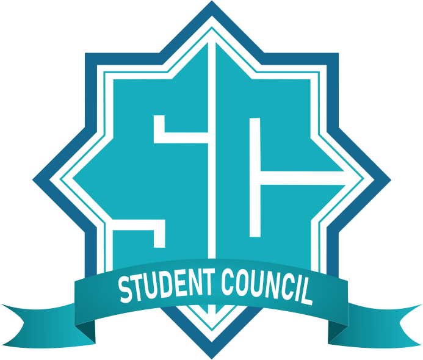

# 🌐 Website Resmi Dewan Mahasiswa Universitas Darussalam Gontor

Selamat datang di repositori resmi website **Dewan Mahasiswa Universitas Darussalam Gontor (DEMA UNIDA Gontor)**. Website ini dikembangkan sebagai media informasi, komunikasi, dan aspirasi mahasiswa, serta sarana publikasi kegiatan kemahasiswaan di lingkungan Universitas Darussalam Gontor.

## 🚀 Fitur Utama

- 📣 Informasi dan pengumuman kegiatan mahasiswa
- 🏛️ Profil lengkap struktur dan departemen DEMA
- 🧭 Visi dan misi organisasi kemahasiswaan
- 🗣️ Aspirasi mahasiswa melalui form digital
- 📅 Kalender kegiatan & dokumentasi galeri
- 📥 Unduhan arsip surat, proposal, dan berkas penting

## 🛠️ Teknologi yang Digunakan

Website ini dibangun menggunakan stack modern:

- **Laravel** — Backend & CMS pengelolaan konten
- **Blade** — Template engine untuk UI/UX
- **Tailwind CSS** — Styling responsif modern
- **MySQL** — Basis data mahasiswa dan kegiatan
- **Vite** — Build tool cepat untuk pengembangan frontend

## 📁 Struktur Direktori
├── app/
├── resources/
│ └── views/ # Halaman Blade
├── public/ # Aset publik (gambar, js, css)
├── routes/web.php # Routing utama
├── database/ # Seeder dan migration
├── .env # Konfigurasi environment
└── ...

## 👥 Kontribusi
Kami terbuka untuk kontribusi, baik berupa saran, bug report, maupun pull request. Silakan fork repositori ini dan kirim PR jika ada perbaikan atau fitur tambahan.

## 📄 Lisensi
Proyek ini berada di bawah lisensi MIT. Silakan gunakan dan modifikasi sesuai kebutuhan dengan tetap mencantumkan atribusi.

"Dari Mahasiswa, Oleh Mahasiswa, Untuk Mahasiswa — Bersama Membangun Peradaban"
— Dewan Mahasiswa UNIDA Gontor

